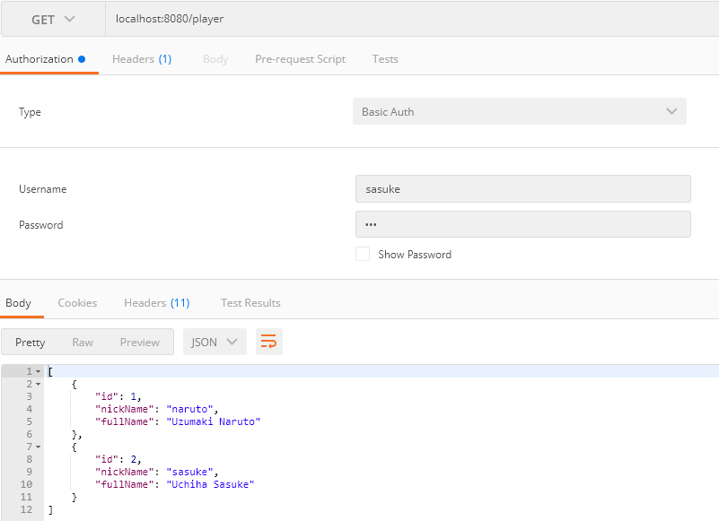

# Card Game
Game about rating card

# Start Game

## Info

There is 2 users for to play the game. Each player is registred in database.

| User   | Password |
|--------|----------|
| sasuke | 123      |
| naruto | 123      |

There is a fews endpoints to iterate with the app. The app have a ordenation to play,
endpoints.

### How to Play

You need get an user and put this user and password as authentication in headers
each request.

Ex.:

EndPoints to play:

1. **/round** _POST_ with the user as you wish in request BODY
2. **/{roundId}** _GET_ This endpoint you can the game status
3. **/round/{roundId}/quiz** _GET_ Enpoint that you can get yours questions 
(This endpoint allways enable, but to make 3 errors you will have a business error)
4. **/round/{roundId}/quiz/{quizId}** _PUT_ Send your answer
5. **/round/{roundId}** _DELETE_ If you wish to end game
